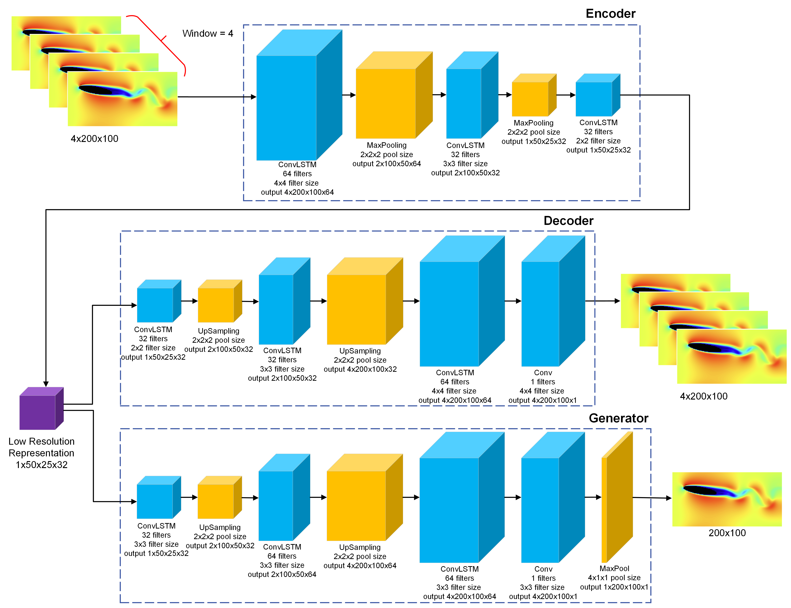
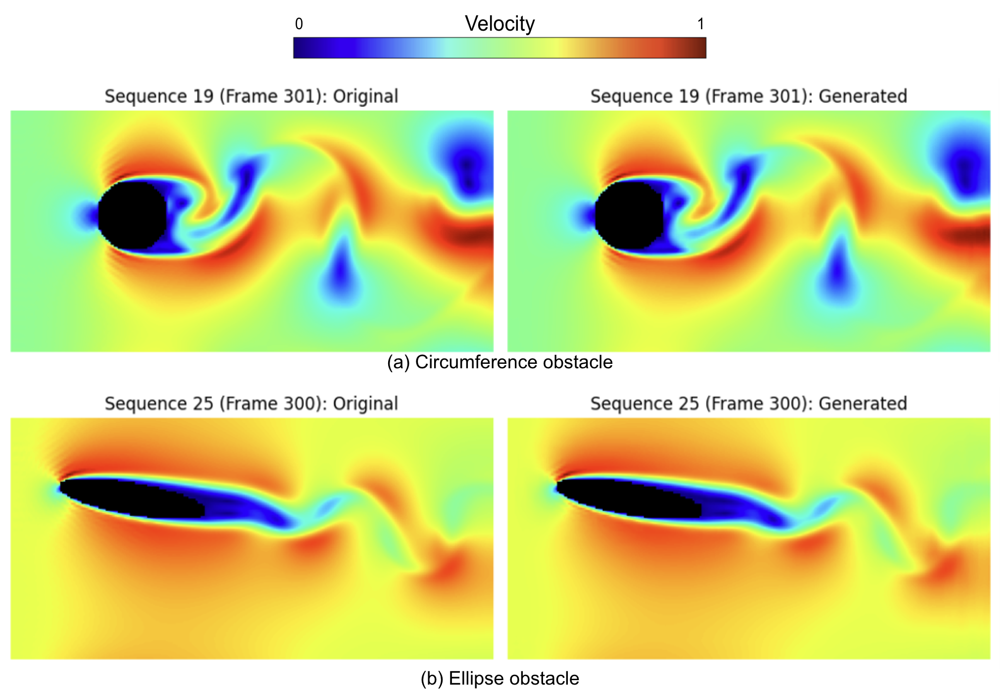

# 📘 Evaluating the Effectiveness of the Convolutional LSTM Neural Network for Simulations in Computational Fluid Dynamics

This repository contains the code and supporting resources for my Master's thesis in Computer Science at the University of Washington (2024). The work explores the use of Convolutional LSTM (ConvLSTM) neural networks to accelerate Computational Fluid Dynamics (CFD) simulations via a purely data-driven model architecture.

---

## 📌 Abstract

Computational Fluid Dynamics (CFD) simulations are essential but computationally expensive tools in engineering. This research proposes an end-to-end neural network based entirely on ConvLSTM to predict spatiotemporal fluid dynamics involving flow around obstacles. The model significantly reduces execution time-by a factor of 4.5-while preserving accuracy, achieving a Mean Squared Error (MSE) of 1.107×10⁻⁵, offering a promising approach to rapid prototyping in fluid dynamics design.

---

## 🧠 Model Overview

The proposed architecture includes:
- An **Autoencoder** for dimensionality reduction.
- A **Generator** for time-series frame prediction.
- An **end-to-end pipeline** capable of simulating 2D turbulent flows.

---

## 🧪 Dataset

- Fluid flow sequences (400 frames each) interacting with obstacles.
- Two obstacle types: **circle** and **ellipse** (simulating airfoil cross-sections).
- Spatial resolution: **200x100 grid cells**
- Reynolds number: **220**
- Preprocessed as **normalized 2D time series** with masked obstacles.

---

## 📊 Results

- **Training error (MSE)**: 7.77×10⁻⁶ (Autoencoder), 1.54×10⁻⁵ (Generator)
- **Validation error (MSE)**: 3.21×10⁻⁵ (Autoencoder), 2.04×10⁻⁵ (Generator)
- **Execution time speed-up**: 4.5× faster than numerical CFD baseline

Original vs Generated frames

Original vs Generated simulations

---

## 📚 Citation

If you use this work, please cite it as:

> Castillo Tosi, A. (2024). *Evaluating the Effectiveness of the Convolutional LSTM Neural Network for Simulations in Computational Fluid Dynamics*. University of Washington. https://hdl.handle.net/1773/51654

---

## 💡 Future Work

- Include more obstacle types
- Include more obstacles in the simulation
- Include moving obstacles in the simulation
- Investigate generalization to different Reynolds numbers (Turbulend and Laminar flows)

---
